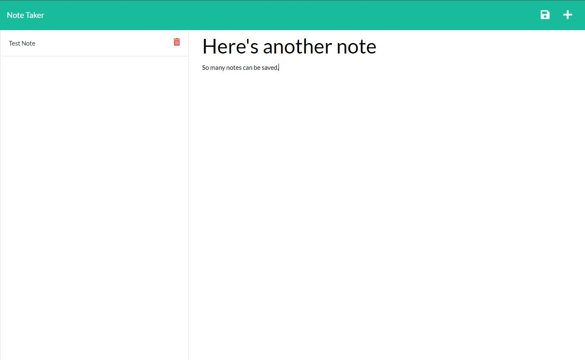
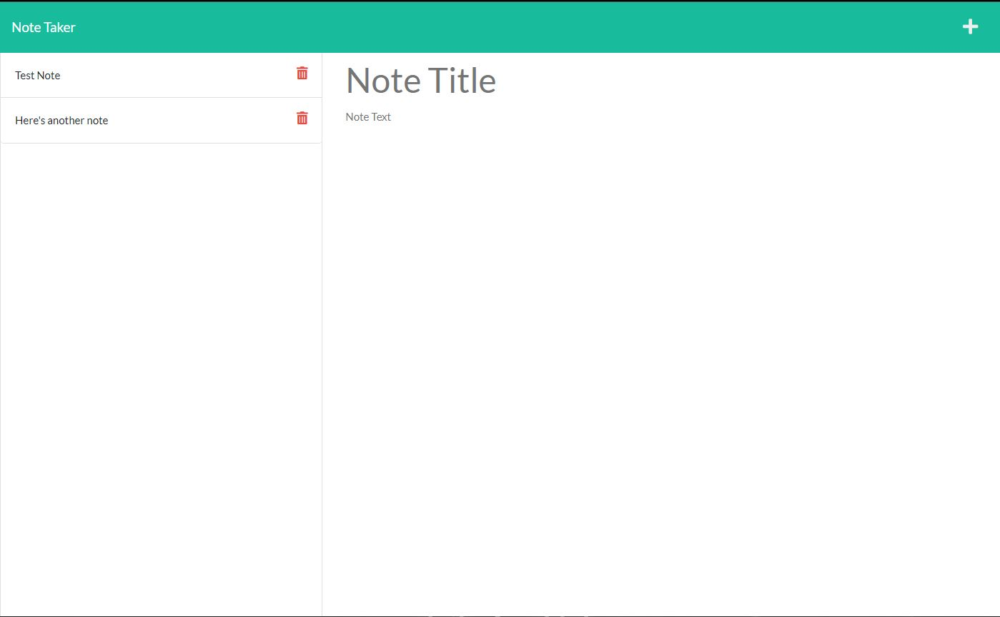

# Express_Note_Taker

## Description

We were given the front end code to create the backend code for an application that allows us to take notes.

## Installation

In order to use the application, the user must install Express

    npm i express

If the user wantes to test the application they must install uuid.

    npm i uuid

## Application

[Heroku](https://express-name-taker-spencer.herokuapp.com/)

## Screenshots

[GitHub](https://github.com/SFSullivan/Express_Note_Taker.git)